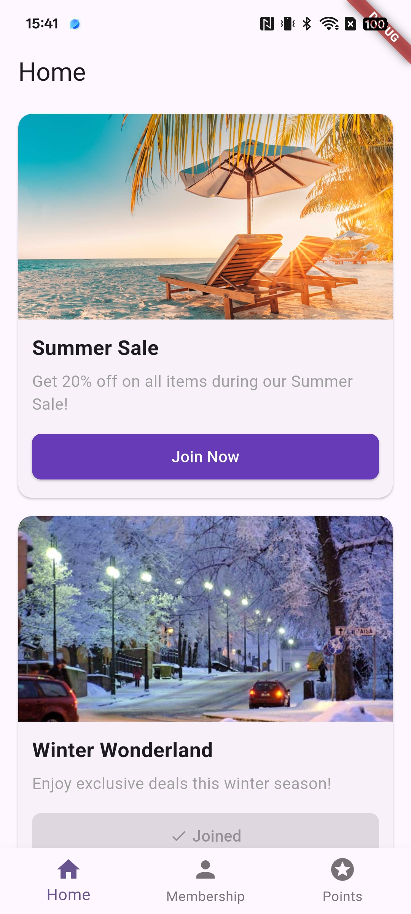
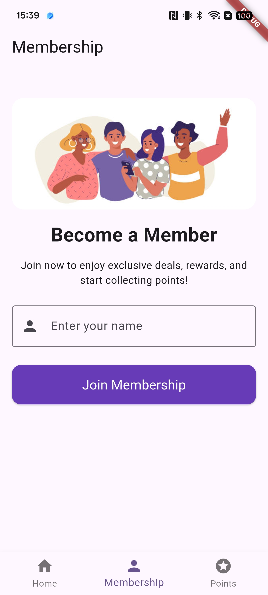
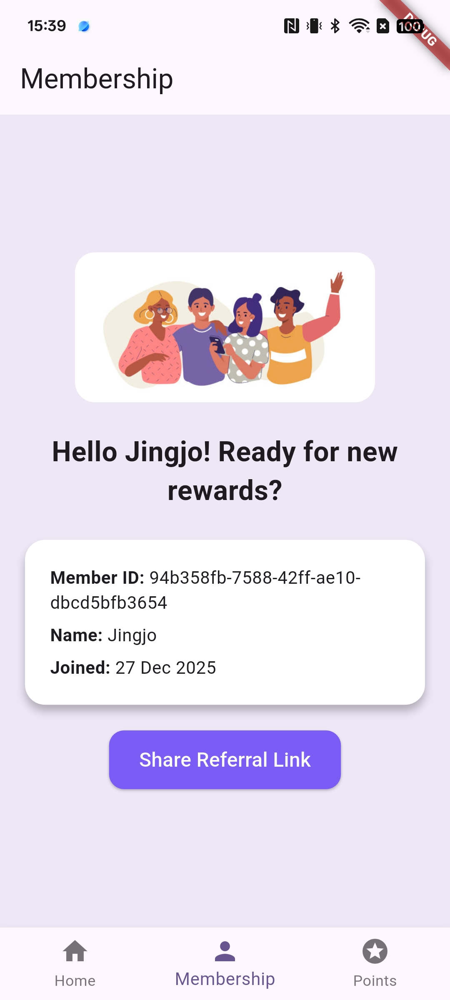
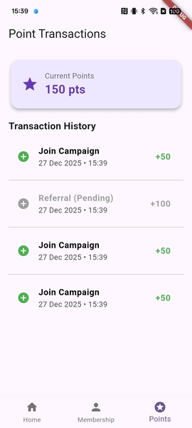

# Jenosize Loyalty Assignment

A prototype mobile application for a Loyalty Platform, developed with Flutter as part of the Jenosize technical assignment.

---

## Features

* **Campaign List**: Display a list of loyalty campaigns
* **Membership**: Join a membership and persist the membership state locally
* **Referral**: Generate and share a referral link
* **Points Tracker**: Display current points and transaction history

---

## Screenshots

### Home Screen


### Membership Screen



### Points Transaction Screen


---

## Tech Stack

* Flutter 3.38.5
* Dart 3.10.4
* State Management: Riverpod
* Local Storage: SharedPreferences

---

## Project Structure

This project follows **Clean Architecture** principles to clearly separate responsibilities across layers:

* **Domain**: Business rules and core entities
* **Data**: Data sources and repository implementations
* **Presentation**: UI and state management

This structure improves maintainability, testability, and scalability, and allows data sources to be replaced (e.g. Local → API/Firebase) with minimal impact on business logic.

---

## Getting Started

### 1. Clone the repository
```bash
git clone https://github.com/napasornsue/jenosize-loyalty-assignment.git
cd jenosize-loyalty-assignment
```

### 2. Check Flutter environment
```bash
flutter --version  # Flutter 3.38.5, Dart 3.10.4
flutter doctor
```

### 3. Install dependencies & Run the app
```bash
flutter pub get
flutter run
```
---

### 🧪 Running Tests
Run all unit tests:
```bash
flutter test
```
Run tests with coverage:
```bash
flutter test --coverage
brew install lcov # if lcov is not installed
genhtml coverage/lcov.info -o coverage/html
open coverage/html/index.html
```

---

## Notes

This project is a prototype and does not connect to a real backend.  
Membership, points, and referral data are stored locally using SharedPreferences.  
Mock data and local storage are used to demonstrate system design and application flow.

* Referral and point logic are simulated for demonstration purposes only.
* The architecture is designed to support future integration with backend services or Firebase.
* Supported platforms: Android & iOS.
* If you encounter build issues, try `flutter clean` then `flutter pub get`.

---

## Bonus Features

- Display pending transactions with gray color and "(Pending)" label
- Personalized welcome messages for returning members
- Automatic navigation from Home → Membership if user is not yet a member
- Sort transactions by latest first
- Referral transaction creation with Pending status
- Simple UI improvements (larger membership image, consistent styling)

---

## Future Requirements

- Integrate with a real backend service for campaigns, membership, referrals, and points
- Add user authentication and profile management
- Implement push notifications for campaign updates and point changes
- Support deep linking for referral links
- Enhance UI/UX with animations and responsive layouts
- Add unit and widget tests for core features
- Implement sorting/filtering options for transaction history

---